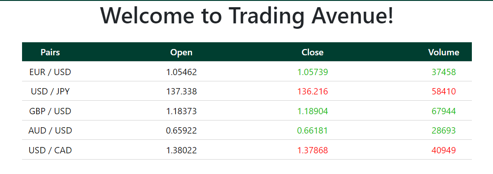

# Trading Avenue

It is a website that simulate the trading experiece. You can buy and sell currencies and have see the history of all your trades. 

This is a responsive web application designed to facilate the consumers's experience when visiting our site.

# Tech stack

Here is an overview of all the tools used to build the site:

* This project uses [Express.js](https://expressjs.com/) as an app to facilitate communication between the front-end and back-end.
* The design for the front-end is mostly handled by [HTML](https://developer.mozilla.org/en-US/docs/Learn/Getting_started_with_the_web/HTML_basics) and [CSS](https://developer.mozilla.org/en-US/docs/Web/CSS).
* The app uses [JavaScript](https://www.javascript.com/) as its programming language.
* For massive storage (database), the app uses the [mongoose](https://mongoosejs.com/) package which allows the app to create a schema and save the data to [mongoDB](https://www.mongodb.com/) database.
* The website use the Oanda api to retrieve price data of different currencies
* Finally, The [React](https://www.reactjs.org) library is used in this project.

# Supporting browser

So far, the app can be run on Microsoft Edge, Chrome and Firefox

# Future Enhancements
* The data retrieve from the api don't change unless the page is refresh which makes the site not displaying the accurate price. This change will happen be applied.
* Some economic news data will also be display on the site to ensure that consumers have all the necessary info to make a decision

